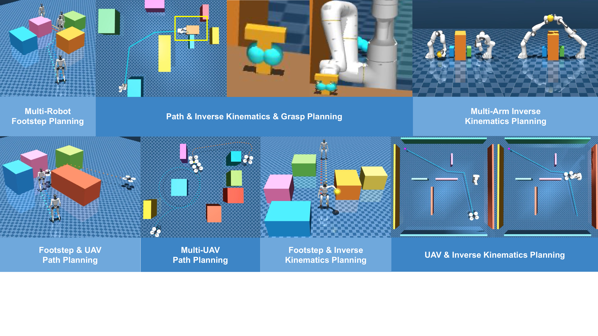

# [CoRL 2026]: M3P-R1: Reinforcement Learning for Large Language Model Guided Multi-Modal Motion Planning via MIP Code Generation

This repository accompanies the CoRL 2026 submission, **M3P-R1: Reinforcement Learning for Large Language Model Guided Multi-Modal Motion Planning via MIP Code Generation**.

Multi-modal motion planning requires robots to coordinate continuous trajectories with discrete decisions such as contacts, grasping, and mode transitions. M3P-R1 fine-tunes large language models to translate natural-language motion-planning tasks into executable mixed-integer programming (MIP) code. The generated programs are solved and checked, providing solver-backed feedback for reliable, verifiable plans across locomotion, manipulation, and aerial-navigation tasks.

  

## Video

[Watch or download the project video](M3PR1.mp4)
